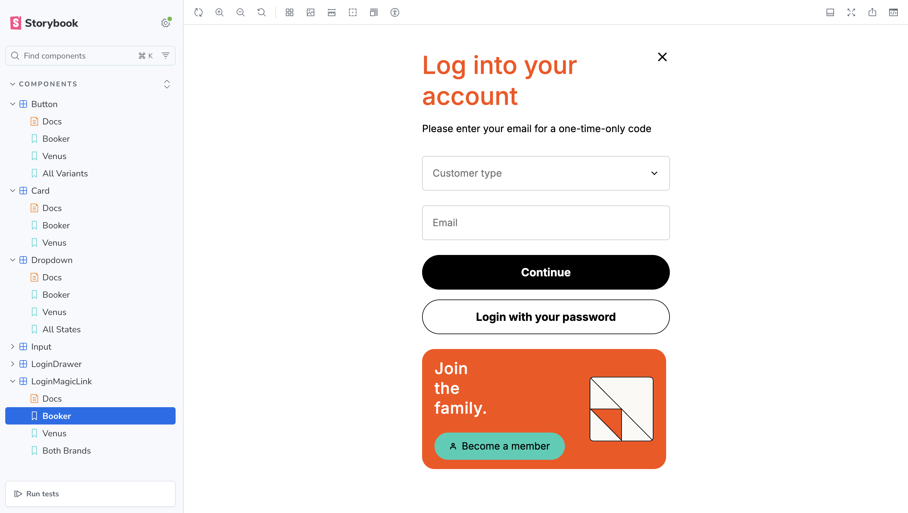

# Biglight Component Library

A multi-brand design system built with Preact, Tailwind CSS, and Storybook. This project demonstrates a scalable approach to building UI components that support multiple brand themes while sharing the same codebase.



## Overview

This component library implements a **design token-driven architecture** that allows the same components to render differently based on brand context. The system supports two brands:

- **Booker (Brand A)** - Features teal/orange color palette with Inter font
- **Venus (Brand B)** - Features cherry/burgundy color palette with Open Sans font

## Key Features

- **Multi-brand theming** - Components automatically adapt to brand context via CSS variables
- **Design token integration** - Figma tokens exported and mapped to CSS custom properties
- **Accessible components** - WCAG-compliant with keyboard navigation and ARIA attributes
- **Type-safe** - Built with TypeScript for better developer experience
- **Storybook documentation** - Interactive component playground with all states documented

## Components

| Component | Description |
|-----------|-------------|
| **Button** | Primary, secondary, and tertiary variants with hover/disabled states |
| **Card** | Promotional card with title and CTA button |
| **Dropdown** | Accessible select component with floating label |
| **Input** | Text input with validation states (error, success) |
| **LoginMagicLink** | Composite login form combining all components |
| **LoginDrawer** | Slide-over panel containing the login form |

## Architecture

```
src/
├── components/           # UI components
│   ├── Button/
│   │   ├── Button.tsx
│   │   ├── Button.styles.ts    # CVA variants
│   │   ├── Button.types.ts
│   │   └── Button.stories.tsx
│   └── ...
├── styles/
│   ├── brands.css              # Brand-to-token mappings
│   ├── tailwind.css            # Tailwind + CSS variable definitions
│   └── generated/              # Auto-generated design tokens
│       ├── brand-booker-tokens.css
│       └── brand-venus-tokens.css
└── tokens/
    └── figma-tokens.json       # Source design tokens
```

### Theming Approach

Components use generic CSS variables (e.g., `--btn-primary-bg`) that are mapped to brand-specific design tokens in `brands.css`:

```css
.brand-booker {
  --btn-primary-bg: var(--mappedBrandASurfaceColourActionPrimary);
}

.brand-venus {
  --btn-primary-bg: var(--mappedBrandBSurfaceColourActionPrimary);
}
```

To switch brands, wrap components in a container with the brand class:

```jsx
<div className="brand-booker">
  <Button variant="primary">Booker Style</Button>
</div>

<div className="brand-venus">
  <Button variant="primary">Venus Style</Button>
</div>
```

## Getting Started

### Prerequisites

- Node.js 18+
- pnpm (recommended) or npm

### Installation

```bash
# Install dependencies
pnpm install

# Start Storybook
pnpm storybook

# Run development server
pnpm dev
```

### Scripts

| Command | Description |
|---------|-------------|
| `pnpm dev` | Start Vite development server |
| `pnpm build` | Build for production |
| `pnpm storybook` | Start Storybook on port 6006 |
| `pnpm build-storybook` | Build static Storybook |
| `pnpm test` | Run tests |

## Tech Stack

- **Framework**: [Preact](https://preactjs.com/) - Lightweight React alternative
- **Styling**: [Tailwind CSS](https://tailwindcss.com/) + [CVA](https://cva.style/) for variant management
- **Documentation**: [Storybook](https://storybook.js.org/) 8.x
- **Build Tool**: [Vite](https://vitejs.dev/)
- **Language**: TypeScript

## Design Tokens

Design tokens are exported from Figma and transformed into CSS custom properties. The token pipeline:

1. **Source**: `src/tokens/figma-tokens.json`
2. **Generated**: `src/styles/generated/brand-*-tokens.css`
3. **Mapped**: `src/styles/brands.css` (component-level variables)
4. **Consumed**: Component styles via `var(--token-name)`

## Accessibility

All components are built with accessibility in mind:

- Keyboard navigation support
- Focus management (auto-focus on drawer open)
- ARIA attributes for screen readers
- Visible focus indicators
- Color contrast compliance

## License

MIT
